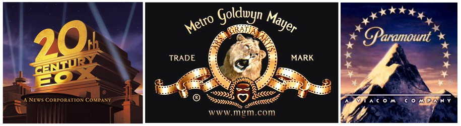

# Finding Success in the Movie Industry

## Project Goals

The goal is to conduct data analysis to get a better understanding of the movie industry. We did exploratory data analysis on several movie datasets to explore what type of films are doing the best in the box office. We answered several questions in which we will be exploring various relationships of successful film characteristics to determine what type of movie we should create.

## The Datasets

We analyzed the following movie related data from the following sources:
* Box Office Mojo
* IMDB
* Rotten Tomatoes
* TheMovieDB.org

## Repo Files

1. Datasets Preview
  * We created a notebook with all the datasets and a preview of each dataset's rows.
2. EDA (Notebooks)
   * We did exploratory data analysis on the datasets and the notebooks contain detailed and organized code for each question. Each question will contain meaningful data visualizations with follow up explanations.
3. Powerpoint Presentation
   * The team gave a high level non-technical overview of our project by providing stakeholders with actionable insights and recommendations for creating the next big film.
4. Video Walkthrough
   * I created a personal presentation by providing a better understanding of our analysis. I explained what the project entails and explored each question in detail.
   
## Exploratory Data Analysis
The film industry is becoming more competitive and faster paced. In addition, people's taste in films change throughout the years based on society changes. In the 40's and 50's, people craved for movies that involved heroism and freedom. Nowadays, people are craving drama and action. We focused on films that were more relevant to today's society and aim to please what the people want. Times have changed and as we strive to create a new movie in this competitive industry, we focused our efforts on films that were only released in the past decade.

## Questions

Q1 - What is the distribution for movies in each genre? What are the top 3 genres that film studios create the most?

Q2 - What are the top 10 most popular and highest rated films? Is there a relationship between popularity and highest rated?

Q3 - What are the top 10 movies with the highest gross profit margin? Is there a relationship between Popularity and Profit Margin?

## Recommendations

In the past decade, 24% of movies are Drama genre, 14% are Documentary, and 13% are Comedy. Drama genre is currently very saturated and appears to be highly rated internationally.

For the top 10 most popular movies, Action movies are the most popular. For Top 10 most highly rated movies, Drama movies win the vote. If we were to pick a genre, it depends if we're looking into starting a film domestically or internationally. If domestically it'll be Action movies, and if internationally it would be Drama genre.
